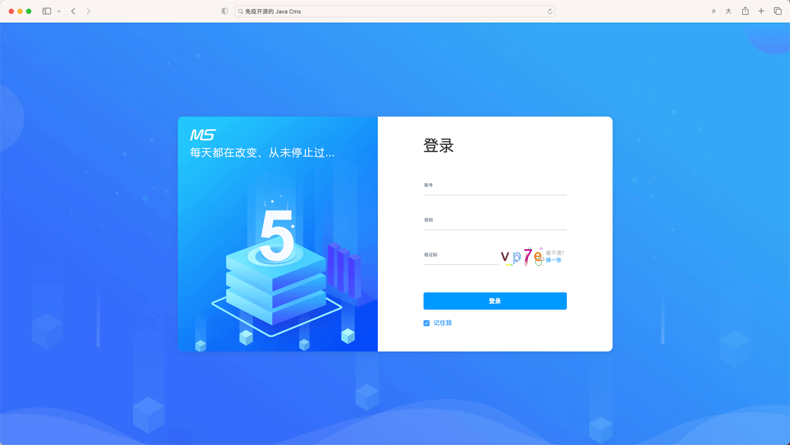
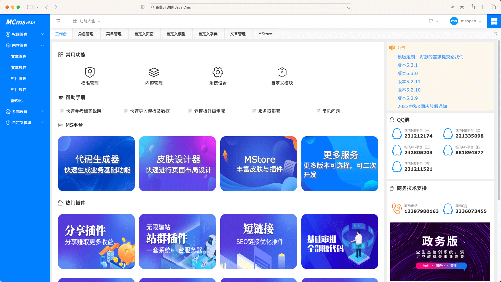
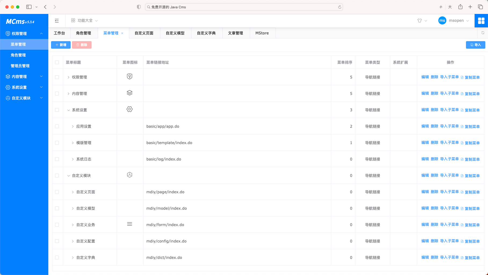
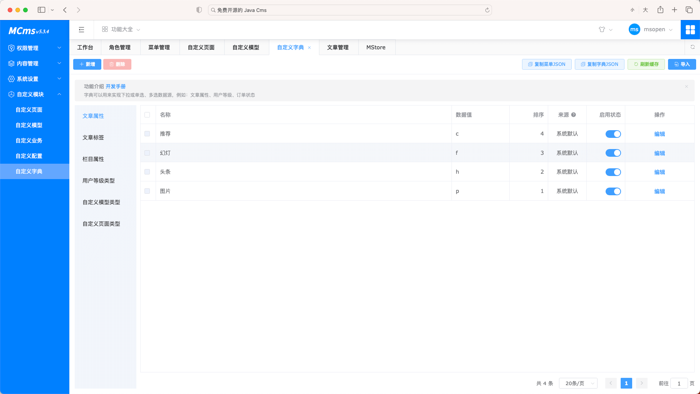
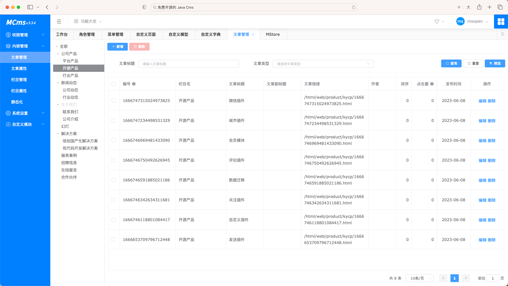
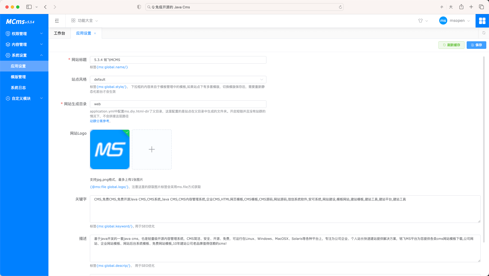
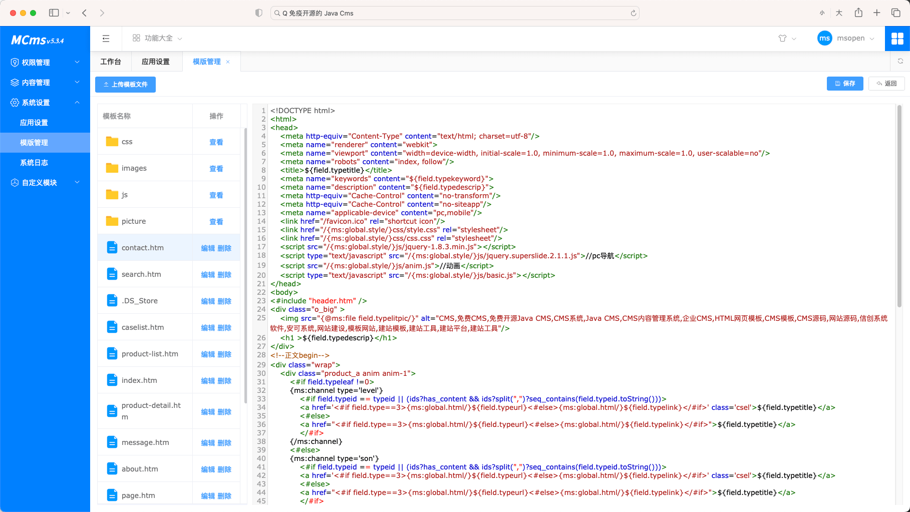
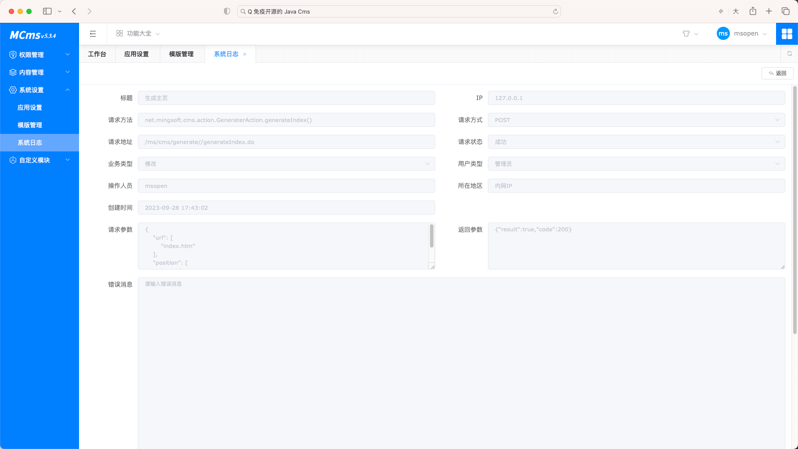
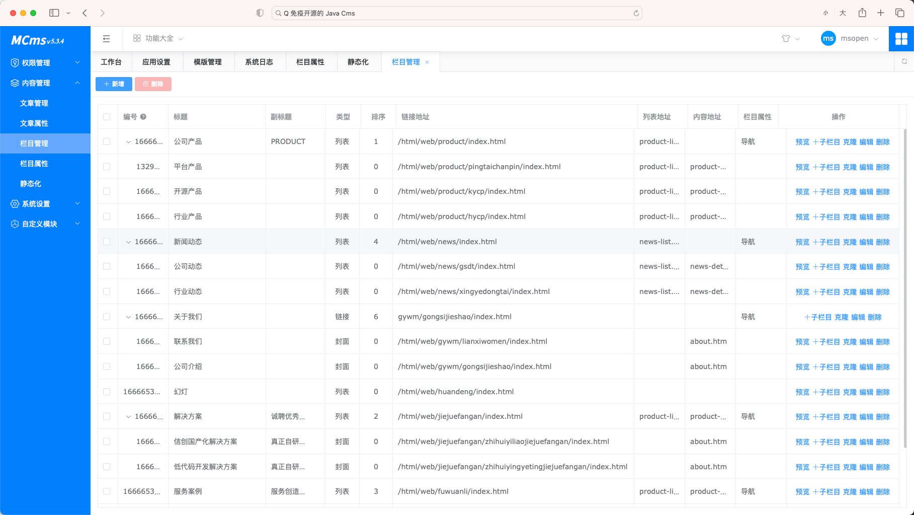

<p align="center">
	<a href="https://www.mingsoft.net/">

</a>
</p>
<p align="center">
	<strong>价值源自分享</strong>
</p>
<p align="center">
	<a target="_blank" href="https://search.maven.org/search?q=ms-mcms">
        
	</a>
	<a target="_blank" href="hhttps://baike.baidu.com/item/MIT%E8%AE%B8%E5%8F%AF%E8%AF%81/6671281?fr=aladdin">
        
	</a>
	<a target="_blank" href="https://www.oracle.com/technetwork/java/javase/downloads/index.html">
		
	</a>
	<a target="_blank" href="https://gitee.com/mingSoft/MCMS/stargazers">
		
	</a>
	<a target="_blank" href='https://github.com/ming-soft/mcms'>
		
	</a>

</p>
<p align="center">
	<a href="https://www.mingsoft.net" target="_blank">MS平台</a> 
	<a href="http://a.cms.demo.mingsoft.net/ms/login.do"  target="_blank">后台演示</a> 
    <a href="http://a.cms.demo.mingsoft.net/"  target="_blank">前台演示</a> 
	<a href="http://doc.mingsoft.net/mcms/"  target="_blank">在线使用手册</a>
	<a href="https://space.bilibili.com/1825880395" target="_blank">B站视频</a><br/>
	<a href="https://ke.qq.com/course/3026403"  target="_blank">代码生成器视频教程</a><br/>
	<a href="https://cloud.189.cn/t/I3maM3uURjmm"  target="_blank">Windows一键运行版本\Linux一键运行版本</a>
    <a href="#快速体验docker" >Docker体验</a>
</p>

-------------------------------------------------------------------------------

<p align="center">
	<strong>一直在改变，从未停止过！努力打造一款国内好用的Java CMS内容管理软件</strong>
</p>

# 邀请您加入技术交流QQ群


[](https://qm.qq.com/cgi-bin/qm/qr?k=FVvyoF1YwtFpCGLf--h42_AwtF6JOD9M&jump_from=webapi&authKey=EyNayGyX0U/6hJKtpBInh9FsCpeM8Vx2KqrmmCZyXe3f1PD5kboChBSIWkB6SOb5) 
[](https://qm.qq.com/cgi-bin/qm/qr?k=fedNH1fR6niG16cYVPXPZJ3U8m9Hfxaf&jump_from=webapi&authKey=6rMUTyta7sKlSpeF/fYkVHp6mF9sZc6i5vmHzGgdh6WHW34yww5eDBXJwCVmoMyl)
[](https://qm.qq.com/cgi-bin/qm/qr?k=1K_RsMwZcf09Y-_74PhA_NfI85RqeDyK&jump_from=webapi&authKey=vCeXrE2f5QCobzDFZ4lHzHyH7sGtmhVfR326MjEmeMy6u0NgHlIglCCxD/6b7tEK)
[](https://qm.qq.com/cgi-bin/qm/qr?k=TzRiJf4x7tZsjKEzo8EuwuHqTALc0xCA&jump_from=webapi&authKey=04YpueACppV1tLykhOQ+fdzPhPwOkIU685LgCOQqrwEjtVQCOvTAyd6qn3xAiXl2)
[](https://qm.qq.com/cgi-bin/qm/qr?k=IfVdHXCm13Ui6NrcjvrraFkGsI8L3U1r&jump_from=webapi&authKey=Go37VdoKublA0p47ww9fS+fxt2DAh1URslG0/7ugg8zs1b+heVlGZwkASM/PlJPG)

[](http://store.mingsoft.net)

[](https://www.mingsoft.net/renwudating.html)

[](https://www.mingsoft.net/)


# 开源说明
* 系统100%开源
* 模块化开发模式，铭飞所开发的模块都发布到了maven中央库。 可以通过pom.xml文件的方式拉取源代码

```
<dependency>
	<groupId>net.mingsoft</groupId>
	<artifactId>模块</artifactId>
	<version>版本号</version>
	<classifier>sources</classifier>
	<scope>provided</scope>
</dependency>
```

# 脚手架版本 

目前 开发版本 以上已经支持VUE3脚手架 <a href="https://www.mingsoft.net/banben.html"  target="_blank">查看版本比对</a>

# 商用
基于[MIT](https://www.oschina.net/question/12_2829) 开源协议，可直接商用无需授权，但请尊重开源精神不要去掉代码中铭飞的注释和版权信息


# 特点
* 免费完整开源：基于MIT协议，源代码完全开源，无商业限制,MS开发团队承诺将MCMS内容系统永久完整开源；<br/>
* 标签化建站：不需要专业的后台开发技能，只要使用系统提供的标签，就能轻松建设网站；<br/>
* html静态化：系统支持全站静态化；<br/>
* 跨终端：站点同时支持PC与移动端访问，同时会自动根据访问的终端切换到对应的界面，数据由系统统一管理；<br/>
* 海量模版：铭飞通过MStore（MS商城）分享更多免费、精美的企业网站模版，降低建站成本；<br/>
* 丰富插件：为了让MCms适应更多的业务场景，在MStore用户可以下载对应的插件，如：站群插件、微信插件、商城插件等；<br/>
* 每月更新：铭飞团队承诺每月28日为系统升级日，分享更多好用等模版与插件；<br/>
* 文档丰富：为了让用户更快速的使用MCms系统进行开发，铭飞团队持续更新开发相关文档，如标签文档、使用文档、视频教程等；<br/>
# 面向对象
* 企 业：帮助创立初期的公司或团队快速搭建产品的技术平台，加快公司项目开发进度；
* 开发者：帮助开发者快速完成承接外包的项目，避免从零搭建系统；
* 学习者：初学JAVA的同学可以下载源代码来进行学习交流；

# 开发环境
建议开发者使用以下环境，这样避免版本带来的问题
* Windows、Linux
* Eclipse、Idea
* Mysql≧5.7 (开启忽略大小写)
* JDK≧8
* Tomcat≧8


# 快速体验（导入到 Eclipse 或 IDEA）

1、检出源代码：
git clone https://gitee.com/mingSoft/MCMS.git<br/>
2、导入项目<br/>
* Eclipse导入，菜单 File -> Import，然后选择 Maven -> Existing Maven Projects，点击 Next> 按钮，选择检出的项目MCMS文件夹，然后点击 Finish 按钮，即可成功导入
* IDEA导入，点击 Import Project，选择 pom.xml 文件，点击 Next 按钮，选择 Import Maven projects automatically 复选框，然后一直点击 Next 按钮，直到点击 Finish 按钮，即可成功导入<br/>

4、Eclipse（IDEA）会自动加载 Maven 依赖包，初次加载会比较慢（根据自身网络情况而定），若工程上有小叉号，请打开 Problems 窗口，查看具体错误内容，直到无错误为止<br/>
5、创建数据库mcms（数据库使用utf-8编码），导入doc/mcms-版本号.sql，如果升级现有系统请使用＊-up-*.sql升级，如果导入了系统对应的完整版SQL，sql升级补丁不需要重复导入；<br/>
6、修改src\main\resources\application-dev.yml文件中的数据库设置参数；<br/>
7、运行MSApplication.java main方法<br/>
8、首先先访问后台地址：http://localhost:8080/ms/login.do ，管理员账号，用户名：msopen 密码：msopen，进入后台点击内容管理->静态化菜单，进行"生成主页"，"生成栏目","生成文章"操作一遍 （注意！！！是后台登录界面，不是会员中心登录界面）

# 快速体验（docker）

```
docker run -p 3306:3306 -p 8080:8080 --name mcms --privileged=true -e TZ=Asia/Shanghai  \
--restart=always -e MYSQL_ROOT_PASSWORD=123456 -d mingsoft/mcms \
--sql-mode="STRICT_TRANS_TABLES,NO_AUTO_CREATE_USER,NO_ENGINE_SUBSTITUTION" \
--lower-case-table-names=1 \
--query-cache-type=1 \
--query-cache-size=600000 \
--max-connections=1000

```
`MYSQL_ROOT_PASSWORD` 数据库密码，如果修改需要修改容器 `/home/mcms/config/` 下配置文件的链接，实际部署可以将 `/home/mcms` 挂载到外部文件夹，方便更新 `mcms` 系统文件


# 技术选型

## 后端框架

| 技术 | 名称           | 官网 |
| :--- |:-------------| :--- |
| Spring Framework | 容器           | [http://projects.spring.io/spring-framework](http://projects.spring.io/spring-framework/) |
| Spring Boot | MVC          | [https://spring.io/projects/spring-boot](https://spring.io/projects/spring-boot) |
| Apache Shiro | 安全           | [http://shiro.apache.org](http://shiro.apache.org/) |
| Spring session | 分布式Session管理 | [http://projects.spring.io/spring-session](http://projects.spring.io/spring-session) |
| MyBatis | DAO          | [http://www.mybatis.org](http://www.mybatis.org/mybatis-3/zh/index.html) |
| MyBatis-Plus | ORM          | [https://baomidou.com/](https://baomidou.com/) |
| Freemarker | 视图           | [http://freemarker.foofun.cn](http://freemarker.foofun.cn/) |
| PageHelper | MyBatis分页插件  | [http://git.oschina.net/free/Mybatis\_PageHelper](http://git.oschina.net/free/Mybatis_PageHelper) |
| Log4J | 日志组件         | [http://logging.apache.org](http://logging.apache.org) |
| Maven | 项目构建         | [http://maven.apache.org](http://maven.apache.org/) |
| Elasticsearch | 分布式搜索引擎      | [https://www.elastic.co](https://www.elastic.co/) |
| Redis | 分布式缓存数据库     | [https://redis.io](https://redis.io) |
| hutool | 工具类          | [http://hutool.mydoc.io](http://hutool.mydoc.io) |

## 前端框架

| 技术 | 名称 | 官网 |
| :--- | :--- | :--- |
| VUE| MVVM框架 | [https://cn.vuejs.org//](https://cn.vuejs.org//) |
| Element UI| UI库 | [https://element.eleme.cn/2.0/#/zh-CN](https://element.eleme.cn/2.0/#/zh-CN) |
| jQuery | 函式库 | [http://jquery.com/](http://jquery.com/) |
| Waves | 点击效果插件 | [https://github.com/fians/Waves/](https://github.com/fians/Waves) |
| validator | 验证库 | [https://github.com/chriso/validator.js](https://github.com/chriso/validator.js) |
| animate | 动画 | [http://daneden.github.io/animate.css/](http://daneden.github.io/animate.css/) |
| icon | 矢量小图标\(待更新\) | [https://www.iconfont.cn/](https://www.iconfont.cn/) |


# 文件说明
* doc 项目文档文件夹，里面有数据库文件
* src/main/java java源代码
* src/main/resources 项目的资源配置文件
* src/main/webapp
* src/main/webapp/static 静态资源文件，如：js、css、image、等第三方前端插件库
* src/main/webapp/html 生成的静态页面，实际项目需要删除，只是提供给开发者快速预览生成后的静态页面
* src/main/webapp/templet 模版文件夹
* src/main/webapp/upload 上传资源文件夹
* src/main/webapp/WEB-INF/manager 后端视图页面
* LICENSE 项目协议说明
* README.md 项目说明文档
* pom.xml 依赖配置文件


# 文档
* 使用手册 http://doc.mingsoft.net/mcms/
* 插件手册 http://doc.mingsoft.net/plugs/

# 关于版本说明 [更多版本查看](https://www.mingsoft.net/banben.html)
1. 开源版本永久免费发布源代码，开发者、企业可以终身免费使用，每个月团队会收集开源系统的问题并在每月的28号进行更新；
2. 企业版本以上更新频率上更快，功能也比开源版本的要多，同时会根据不同版本提供额外插件，不同版本也会提供不同的人工在线服务（服务时间工作日 9:30-17:30）

# 软件截图

<table>
    <tr>
        <td></td>
        <td></td>
    </tr>
    <tr>
        <td></td>
        <td></td>
    </tr>
    <tr>
        <td></td>
        <td></td>
    </tr>
    <tr>
        <td></td>
        <td></td>
    </tr>
    <tr>
        <td></td>
        <td></td>
    </tr>
</table>

# 铭飞平台

以下功能都可以在平台 https://www.mingsoft.net 上免费使用
做开源我们是业余的，写代码我们是认真的。研发产品的路上我们一直在探索、一直在学习、一直在用心投入，希望能给更多的企业与开发者提供一些更有价值的服务。

## 项目管理

<table>
	<tr>
		<td></td>
	</tr>
	<tr>
		<td></td>
	</tr>	
</table>

## 代码生成器

<table>
	<tr>
		<td></td>
	</tr>
	<tr>
		<td></td>
	</tr>	
</table>

## 模版插件分享

价值源自分享，开发者可以再MStore安装分享插件进行分享模版（后续会升级到插件分享），让代码给开发者带来更多的被动收入！  


